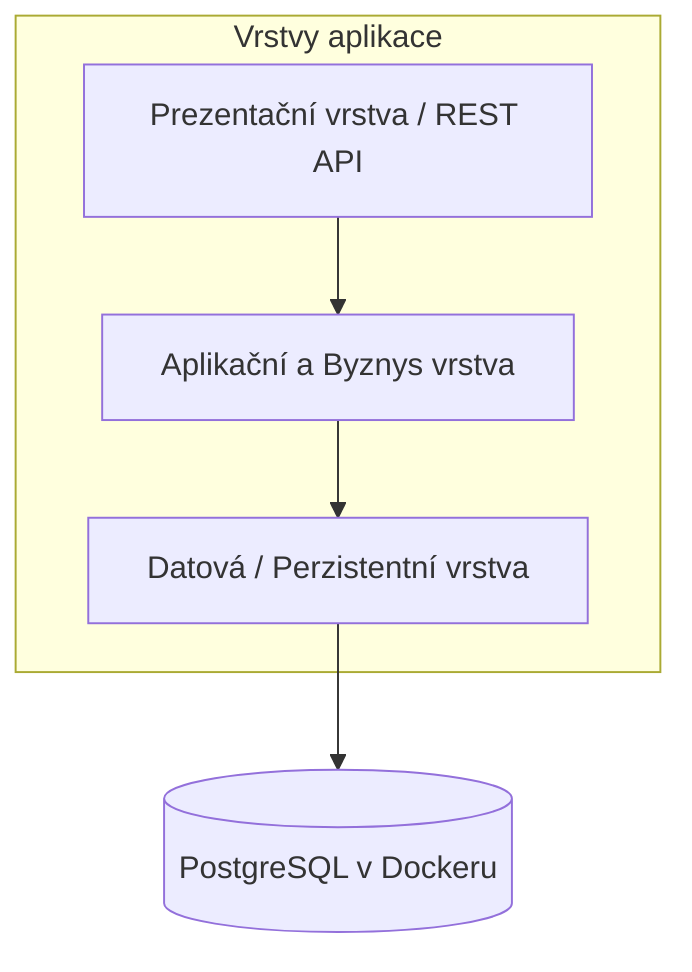
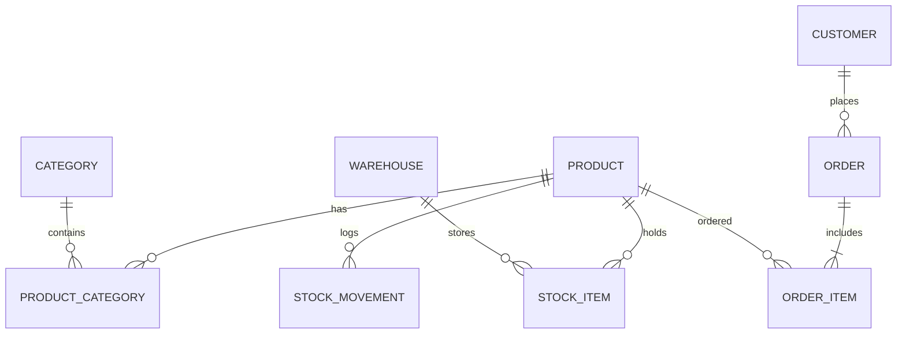

# Sklad pro malý e-shop (Dřevěnka s.r.o.)
> **Semestrální projekt předmětu Pokročilé programování (PPRO)**  
> **Fakulta informatiky a managementu, Univerzita Hradec Králové (ZS 2026/2027)**  
> **Zvolené zadání:** Zadání B – Sklad pro malý e-shop  
> **Klient:** Dřevěnka s.r.o.  
> **Role klienta na cvičení:** Vyučující předmětu PPRO

---

## 📌 1. O projektu a zadání klienta

### 1.1 Kontext klienta
Společnost **Dřevěnka s.r.o.** podniká deset let s prodejem kvalitních dřevěných hraček. V posledních třech letech jí rostou tržby a naráží na limity současného provizorního řešení.

- **Současný stav:**
  - Jeden Excel soubor se cca 400 položkami, otevřený současně na třech různých počítačích (časté kolize a nekonzistence).
  - Zásoby jsou rozděleny do **dvou skladů**:
    1. **Hlavní sklad v Hradci Králové** (běžný provoz a expedice).
    2. **Sklad v Třebechovicích pod Orebem** (fakticky garáž, kam se odkládá sezónní zboží a zásoby).
  - Objednávky přicházejí z e-shopu do e-mailu a do Excelu se přepisují ručně.
- **Kritický problém klienta:**
  - Přibližně 2× do měsíce se prodá zboží, které ve skutečnosti není na skladě. Následuje trapné telefonické omlouvání zákazníkům, což klient označuje za nejhorší část své práce.
  - Chybí jakákoliv evidence přesunů mezi garáží a Hradcem Králové a dohledatelnost skladových pohybů.

---

### 1.2 Co klient chce (Funkční požadavky)
1. **Produkty a kategorie:**
   - Každý produkt má název, kód (SKU), popis, nákupní cenu a prodejní cenu.
   - Podpora více kategorií na produkt (vazba M:N): např. jedna káča patří současně do kategorií *„pro batolata“* a *„dárky do 500 Kč“*.
2. **Zásoby po skladech:**
   - U každého produktu musí být přehledně vidět stav zásoby: kolik kusů je v Hradci Králové a kolik v garáži v Třebechovicích.
3. **Objednávky zákazníků:**
   - Objednávka obsahuje údaje o zákazníkovi, datum vzniku, stav zpracování a jednotlivé položky (objednané množství a cena, za kterou bylo prodáno).
4. **Odmítnutí objednávky při nedostatku zásob:**
   - Klíčová funkce zabraňující prodeji neexistujícího zboží. Pokud není k dispozici dostatek zásob, objednávka nesmí být přijata k expedici.
5. **Dohledání pohybu (Auditní stopa):**
   - Ke každému výdeji a příjmu musí být dohledatelné, ze kterého skladu bylo vydáno/přijato. Možnost odpovědět na otázku *„kde je ta káča, co jsem ji měl minulý týden“*.
6. **Přesun mezi sklady:**
   - Funkce pro evidenci převozu zboží ze zimní garáže v Třebechovicích do hlavního skladu v Hradci Králové a naopak.
7. **Minimální zásoba a doobjednání:**
   - Každý produkt má definovanou minimální bezpečnou zásobu. Seznam produktů pod tímto limitem je zobrazen prioritně na hlavní stránce / dashboardu.
8. **Měsíční obrat po kategoriích:**
   - Přehled a statistika tržeb za zvolený měsíc rozpadlá podle jednotlivých kategorií produktů (*„co klienta živí“*).

---

### 1.3 Na čem klient trvá (Obchodní pravidla a invarianty)
- ❌ **Vydat víc, než je na skladě, nesmí jít za žádných okolností.** Ani omylem, ani ručně.
- 🔒 **Cena v odeslané objednávce se nesmí zpětně změnit**, pokud dojde k úpravě ceníku či ceny produktu v katalogu.
- 📜 **Každá změna stavu zásob musí být zpětně dohledatelná** s přesným časem, důvodem a skladem (*„Chci vidět, proč jich je sedmnáct a ne dvacet.“*).
- 👤 **Zákazník se z databáze nikdy nemaže**, protože se k objednávkám vrací při reklamacích a dotazech.

---

### 1.4 Co klient prohodil mimochodem (Podružná přání)
- *„Poštovné řešit nemusíme, to počítá e-shop.“* $\rightarrow$ Skladový systém neřeší kalkulaci dopravného.
- *„Ať to jde používat i z mobilu, já jsem půlku dne ve skladu.“* $\rightarrow$ Responzivní, ergonomické rozhraní použitelné na mobilním telefonu či tabletu skladníka.
- *„Faktury zatím ne, ale jednou určitě.“* $\rightarrow$ Systém je navržen rozšiřitelně, ale fakturace není součástí první verze.
- *„Nejradši bych to měl barevně, ať vidím, co hoří.“* $\rightarrow$ Vizuální indikátory (červená pro stav pod minimem, žlutá pro blížící se minimum, zelená pro dostatek).

---

## ⚖️ 2. Rozhodnutí k otevřeným bodům zadání

Dle pokynů k semestrálnímu projektu obsahuje tato sekce konkrétní rozhodnutí s odůvodněním k pěti otevřeným bodům zadání B:

### 1. Objednávka ze dvou skladů naráz
- **Rozhodnutí:** Systém umožňuje odbavit objednávku rozdělením na dílčí skladové výdejky pro jednotlivé sklady (split fulfillment), pokud celková disponibilní zásoba pokrývá objednávku, ale žádný samostatný sklad nemá všechny položky. Systém zároveň nabídne možnost vygenerovat interní přesun z garáže do Hradce Králové pro expedici z jednoho místa.
- **Odůvodnění:** E-shop nesmí zbytečně odmítat platícího zákazníka, pokud zboží reálně existuje na skladech Dřevěnky; poštovné navíc dle vyjádření klienta řeší samotný e-shop, takže skladový systém se soustředí na přesnou evidenci toho, ze kterého skladu jaké zboží fyzicky odešlo.

### 2. Co znamená „dost zásob“ (Okamžik odečtení zásoby a rezervace)
- **Rozhodnutí:** Zavádíme dvoufázové řízení skladové dostupnosti:
  $$\text{Disponibilní zásoba} = \text{Fyzická zásoba na skladě} - \text{Rezervováno rozpracovanými objednávkami}$$
  Zásoba se okamžitě **rezervuje** při přijetí/zaplacení objednávky (což okamžitě sníží disponibilní zásobu pro další nákupy), zatímco fyzický odpis z regálu a zápis výdejového pohybu nastává až při **expedici zboží**.
- **Odůvodnění:** Okamžitá rezervace spolehlivě eliminuje hlavní bolest klienta (prodej zboží, které již bylo slíbeno někomu jinému), zatímco fyzický stav na skladě přesně odpovídá tomu, co skladník vidí v regálu až do okamžiku zabalení do balíku.

### 3. Záporný stav a inventura
- **Rozhodnutí:** Výdej do záporného stavu je v celém systému striktně zakázán na úrovni databázových integritních omezení i servisní logiky. Neshody v garáži (kde stav „nikdy nesedí“) se řeší výhradně modulem **Inventura**, který po přepočítání vygeneruje auditovaný inventurní pohyb (manko / přebytek) s povinným zdůvodněním a narovná stav na zjištěnou realitu.
- **Odůvodnění:** Zajišťuje se stoprocentní splnění klientovy podmínky *„Vydat víc, než je na skladě, nesmí jít“*, přičemž klient získává legitimní, plně dohledatelný nástroj k pravidelnému vyčištění a srovnání nesrovnalostí v třebechovické garáži.

### 4. Varianty produktu
- **Rozhodnutí:** Každá fyzicky odlišitelná varianta (např. *káča červená*, *káča modrá*, *káča přírodní*) je vedena jako samostatná skladová položka (`Product`) s vlastním unikátním SKU kódem, čárovým kódem a nezávislou skladovou zásobou, přičemž je provázána vazbou na společnou skupinu produktů (`ProductGroup` / rodina modelu) pro společný popis a prezentaci.
- **Odůvodnění:** Skladník potřebuje vědět přesný počet kusů každé konkrétní barvy v daném regálu; sloučení variant do jednoho beztvarého produktu by vedlo k chybám při expedici a neschopnosti garantovat dostupnost konkrétní varianty.

### 5. Změna objednávky po zaplacení
- **Rozhodnutí:** Objednávku je povoleno upravit (změnit položky nebo množství) pouze ve stavu `Zaplaceno / Čeká na zpracování`. Při úpravě systém uvolní původní rezervace, ověří dostupnost nových položek, vytvoří nové rezervace a vyčíslí přeplatek/nedoplatek. Jakmile je objednávka přepnuta do stavu `Ve vychystávání` nebo `Expedováno`, je pro přímé změny uzamčena a další požadavky se řeší standardní novou objednávkou nebo vratkou.
- **Odůvodnění:** Zabraňuje se chaosu ve skladu, aby skladník nebyl zmaten změnou objednávky v momentě, kdy ji již drží v ruce a balí, a současně umožňuje klientovi vyjít vstříc zákazníkovi, který zavolá bezprostředně po nákupu.

---

## 🏗️ 3. Architektura a technický návrh

Systém je navržen dle požadavků předmětu PPRO na **třívrstvou architekturu se striktně jednosměrnými závislostmi**:



### 3.1 Datový model a entity (minimálně 5 entit + vazba M:N)
Navržený model obsahuje 8 provázaných entit pokrývajících celou doménu:

1. **`Product` (Produkt / Varianta):**
   - `id`, `sku_code`, `name`, `description`, `purchase_price`, `selling_price`, `min_stock_level`, `product_group_id`, `created_at`
2. **`Category` (Kategorie):**
   - `id`, `name`, `slug`, `description`
3. **`ProductCategory` (Vazební entita M:N):**
   - `product_id`, `category_id` (spojuje produkty a kategorie)
4. **`Warehouse` (Sklad):**
   - `id`, `code` (HRADEC / TREBECHOVICE), `name`, `address`, `is_active`
5. **`StockItem` (Stav zásoby na skladu):**
   - `id`, `product_id`, `warehouse_id`, `physical_quantity`, `reserved_quantity`
   - *Integritní omezení:* `physical_quantity >= 0`, `reserved_quantity >= 0`, `reserved_quantity <= physical_quantity`
6. **`StockMovement` (Kniha skladových pohybů / Audit log):**
   - `id`, `product_id`, `source_warehouse_id` (nullable), `target_warehouse_id` (nullable), `type` (RECEIPT, DISPATCH, TRANSFER, INVENTORY_ADJUSTMENT), `quantity`, `reference_order_id` (nullable), `note`, `created_at`
7. **`Customer` (Zákazník):**
   - `id`, `first_name`, `last_name`, `email`, `phone`, `street`, `city`, `zip`, `created_at` (nemaže se)
8. **`Order` (Objednávka):**
   - `id`, `order_number`, `customer_id`, `status` (CREATED, RESERVED, PROCESSING, DISPATCHED, CANCELLED), `total_price`, `created_at`
9. **`OrderItem` (Položka objednávky):**
   - `id`, `order_id`, `product_id`, `warehouse_id`, `quantity`, `unit_price_at_purchase` (zafixovaná prodejní cena v době koupě)



---

## 📋 4. Kontrolní checklist povinného minima PPRO

| Požadavek | Stav | Poznámka k realizaci |
| :--- | :---: | :--- |
| **Tři vrstvy se závislostmi jedním směrem** | ⏳ Návrh | Controllers $\rightarrow$ Services $\rightarrow$ Repositories |
| **Relační databáze v Dockeru** | ⏳ Návrh | PostgreSQL kontejner |
| **Databázové migrace** | ⏳ Návrh | Verzované DDL migrace (žádné ruční vytváření tabulek) |
| **Nejméně 5 entit** | ✅ Návrh | Navrženo 8 entit (Product, Category, Warehouse, StockItem, StockMovement, Customer, Order, OrderItem) |
| **Alespoň jedna vazba M:N** | ✅ Návrh | Vazba mezi `Product` a `Category` (`ProductCategory`) |
| **Automatizované testy** | ⏳ V přípravě | Unit testy disponibilní zásoby, zamezení záporu, fixace cen; integrační testy transakcí |
| **Spuštění příkazem `docker compose up`** | ⏳ V přípravě | Kompletní konfigurace v `docker-compose.yml` |
| **Technická dokumentace v README.md** | ✅ Hotovo | Detailní zadání, pravidla, rozhodnutí k otevřeným bodům |
| **Syntetická data (žádné osobní/citlivé údaje)** | ✅ Zajištěno | Výhradně fiktivní testovací data a hračky Dřevěnky |

---

## 🛠️ 5. Technologický stack (Potvrzeno)

Systém je postaven na moderním, robustním a typovém stacku splňujícím veškerá akademická i průmyslová kritéria PPRO:
- **Jazyk & Runtime:** Java 21+ (Java 25 LTS).
- **Backend / Aplikační rámec:** Spring Boot 3.x (Spring Web, Spring Data JPA, Jakarta Validation).
- **Databáze:** PostgreSQL 16 (běžící v Dockeru).
- **Databázové migrace:** Flyway (verzované SQL skripty `V1__...`, `V2__...`).
- **Dokumentace API:** SpringDoc OpenAPI 3 / Swagger UI (`/swagger-ui.html`).
- **Frontend / Demo rozhraní:** Webové responzivní rozhraní pro skladníka i klienta (`src/main/resources/static`).
- **Kontejnerizace:** Docker & Docker Compose (`docker compose up --build`).
- **Implementační plán:** Kompletní plán s odškrtávacím seznamem je v souboru [IMPLEMENTATION_PLAN.md](file:///u:/PPRO/PPRO/IMPLEMENTATION_PLAN.md).

---

## ⚙️ 6. Návod na zprovoznění a spuštění (Bude aktualizováno)

### Prerekvizity:
- Docker Desktop & Docker Compose
- Java 21+ (na vývojovém stroji)
- Git

### Spuštění celého projektu:
```bash
docker compose up -d
```
Aplikace a databáze automaticky naběhnou, proběhnou migrace a databáze se naplní výchozími syntetickými daty.

---

## 📈 7. Záznamy postupu a technický deník (Changelog)

- **2026-09-30:**
  - Inicializace Git repozitáře a napojení na remote `origin` (`https://github.com/Miskoslav/PPRO.git`).
  - Analýza oficiálního zadání PPRO (ZS 2026/2027) a volba **Zadání B: Sklad pro malý e-shop (Dřevěnka s.r.o.)**.
  - Vypracování [AGENTS.md](file:///u:/PPRO/PPRO/AGENTS.md) s kodifikací zásad: zákaz samovolných commitů bez výslovného pokynu, README.md jako jediný zdroj pravdy (SSOT), automatické pre-commit hooky.
  - Implementace Git `pre-commit` hooku kontrolujícího přítomnost aktualizace `README.md` před každým commitem (`.githooks/pre-commit`).
  - Vytvoření kompletní technické dokumentace a řešení všech 5 otevřených bodů zadání v [README.md](file:///u:/PPRO/PPRO/README.md).
  - Anonymizace a odstranění osobních údajů a e-mailových adres z dokumentace a konfiguračních souborů.
  - Doplnění Zásady 1b do [AGENTS.md](file:///u:/PPRO/PPRO/AGENTS.md) o povinnosti detailních, strukturovaných a vypovídajících commit zpráv.
  - Zvolen technologický stack: **Java (Spring Boot 3) + PostgreSQL + Flyway + Docker Compose**.
  - Doplnění Zásad 7 a 8 do [AGENTS.md](file:///u:/PPRO/PPRO/AGENTS.md) (důsledné komentování kódu a správa úkolů přes odškrtávací seznam).
  - Vytvořen kompletní [IMPLEMENTATION_PLAN.md](file:///u:/PPRO/PPRO/IMPLEMENTATION_PLAN.md) přímo v projektu pro Milestone 1 (demo entity `Product`).
